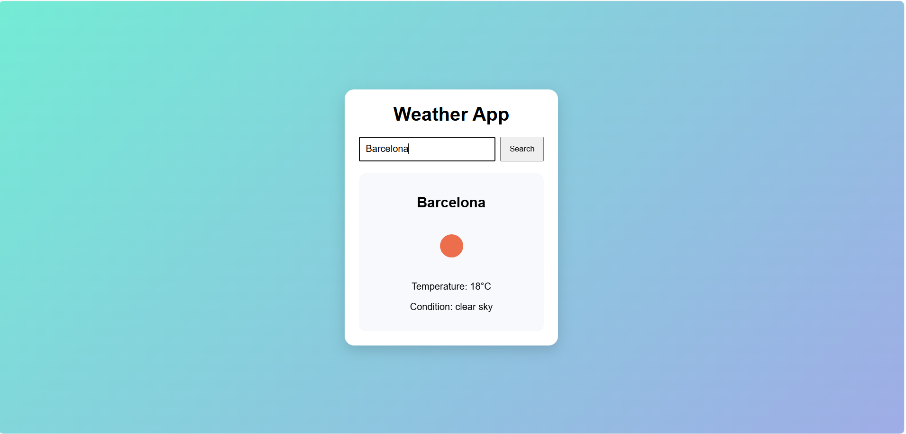

# Weather App

A simmple weather application built with HTML, CSS and JavaScript using the OpenWeather API.

## Features

- Search weather by city name
- Display current temperature
- Show weather description
- Show weather icon
- Eroor handling for invalid city names
- Loading state while fetching data
- Search by pressing Enter

## Technologies

- HTML
- CSS
- JavaScript
- Fetch API
- Async/Await
- OpenWeather API

## Project Goal

This project was created to practice working with APIs, asynchronous JavaScript, DOM manipulation, and error handling.

## Live Demo

[Open Project](https://weather-app-archyteam.netlify.app)

## Screenshot

> Note: This project uses a client-side API key for educational purposes.
